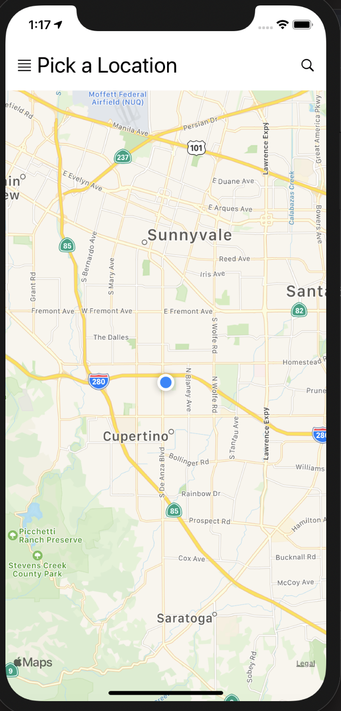
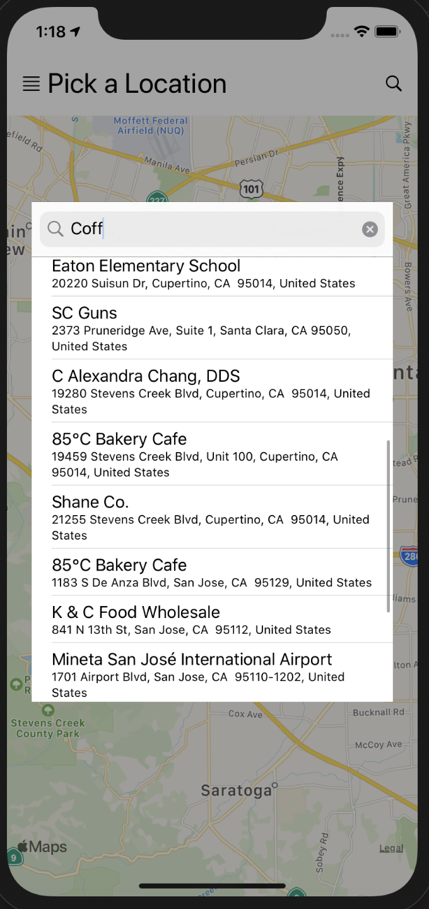
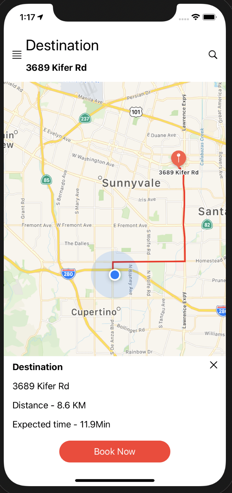
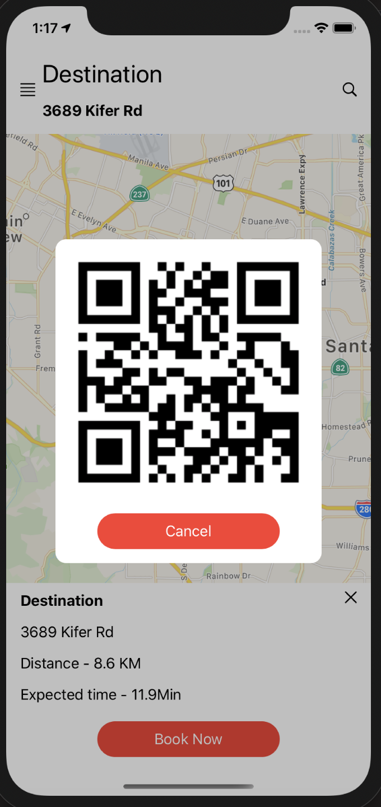
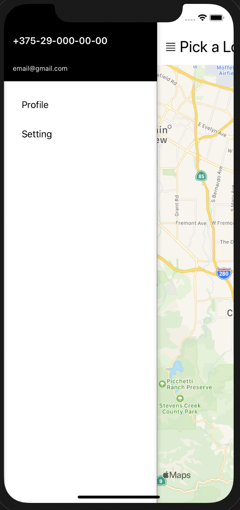

## Uber Clone App

- You can selec any destination and book a car
- Search modal where you can find particular place
- Save Order DATA to Firebase DB(after saving Data create QR code with it)
- Menu with other pages(pages will be implemented in future commits)

Need to add Google Service Info plist file!

